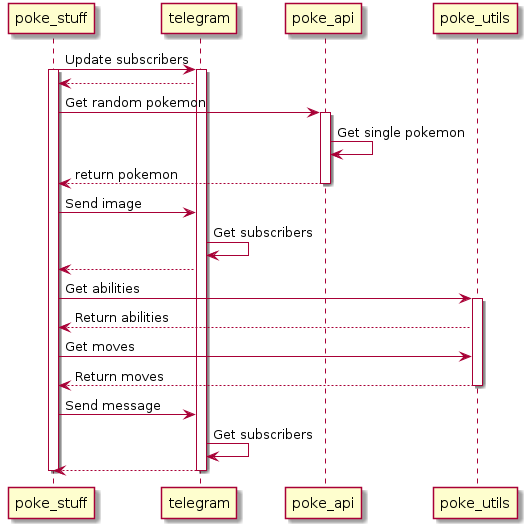

# Telegram Poke Data
This application uses the [PokéApi](https://pokeapi.co/) v2 and the [Telegram Bot API](https://core.telegram.org/bots/api) to send subscribers information about a random Pokémon.

## Requirements
The Application requires `Python v3.8`. It may also work with a lower version. 

This application requires the following modules:
* ThreadPool
* requests
* math
* os
* random

Those modules should have been installed alongside python. Therefore you will most probably not have to install any of them. 

## Installation / Setup
The setup of the application requires more manual actions because this application isn't really meant to be distributed.

First of all clone this repository in your desired location.

For https:
```shell script
git clone https://github.com/GRcwolf/Telegram-Poke-Data.git
```
Or over ssh:
```shell script
git clone git@github.com:GRcwolf/Telegram-Poke-Data.git
```

Both of the above methods should work fine and you can chose the one you like best.

### File Setup
You need to create some files manually. Otherwise the program will crash while trying to open them.

#### Telegram API Key
You need the Key of your bot to send data over it.
First create a bot using the [official documentation](https://core.telegram.org/bots#3-how-do-i-create-a-bot).

Create a new file `.key`. This file should contain the token of your bot.
The file's content must not end in a new line at the end of the file. The __only__ content of the file is the token and nothing else.

#### Store files
You need to create additional files to allow the application to store data.

First create a file `.chats`. This file is completely empty.

Afterwards create a file called `.last_update`. This file should contain `1` as text.
This file also can't have a line break at the end.

## Usage

### Running the application
You can run the application with$
```shell script
python poke_stuff.py
```

On Linux or other systems with multiple python versions installed you may need to write
```shell script
python3 poke_stuff.py
```

#### Cron jobs
You can also define this as a cron job if you like.
This isn't a problem because the program does not require any user interaction while running. 

### Using the bot
You can get the information about the pokemon if you text your bot the command `/subscribe` (a simple text message).

The subscribers will receive the information about the pokemon when the application is executed.

You can also unsubscribe from the the list with the command `/unsubscribe`.

## How it works
This section shows how the application works.

### Understanding the files
| File         | Description                                                      |
| ------------ | -----------------------------------------------------------------|
| .chats       | Contains the chat ids which are subscribed. (one for each line)  |
| .key         | Contains the token of your bot.                                  |
| .last_update | Contains an integer defining the id of the last bot update call. |

For the functionality and the understanding of the, please refer to to python files themselves.

### Overview of the programs procedure
This diagram should provide an overview of how the program acts.

